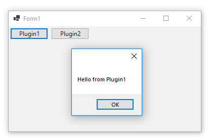
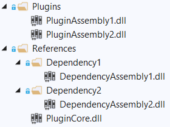
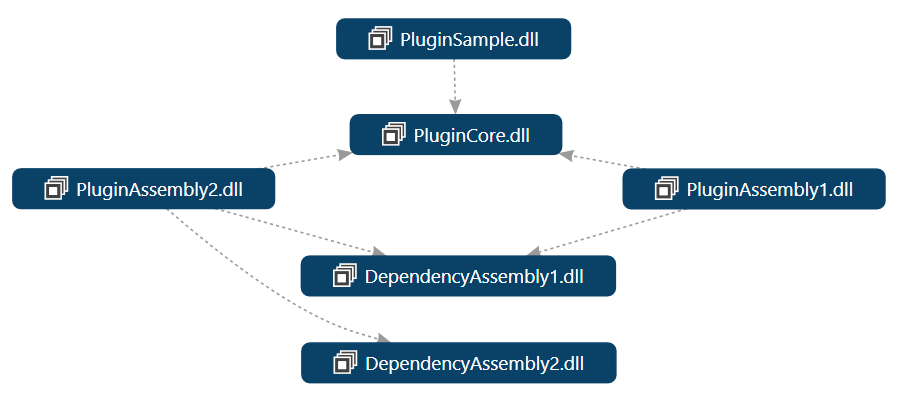

## Load plugins at run-time
This .NET CORE example shows how you can load assemblies at run-time and resolve dependencies without adding reference to those assemblies in your project. 

The `PluginSample` is a Windows Forma example which scans a folder calles `plugings` and loads all assemblies and from those assemblies get classes which implement an `IPlugin` interface and add a button to the form. Then if you click on the button, `SayHello` method of the plugin will be run:

To resolve the dependencies it's relying on [`AssemblyResolve`](https://docs.microsoft.com/en-us/dotnet/api/system.appdomain.assemblyresolve?WT.mc_id=DT-MVP-5003235) event of the `AppDomain`. Since the example loads all the plugin assemblies in the current app domain, it handles the event for [`AppDomain.CurrentDomain`](https://docs.microsoft.com/en-us/dotnet/api/system.appdomain.currentdomain?WT.mc_id=DT-MVP-5003235) and load the requested assembly in the event handler.

This is what the application is doing to load and run plugins:

* Get all assembly files form plugins folder
* Get all assembly files from references folder (entire hierarchy)
* Handle `AssemblyResolve` of `AppDomain.CurrentDomain` and check if the requested assembly name is available files of reference folder, then load and return assembly.
* For each assembly file in plugins folder, get all types and if the type implements your plugin interface, instantiate it and call its entry point for example.

This is the file structures for the plugins in the example:

And this is dependency diagram of the components:

As you can see in the diagram, the application (PluginSample) doesn't have any dependency to plugins (PluginAssembly1, PluginAssembly2).
